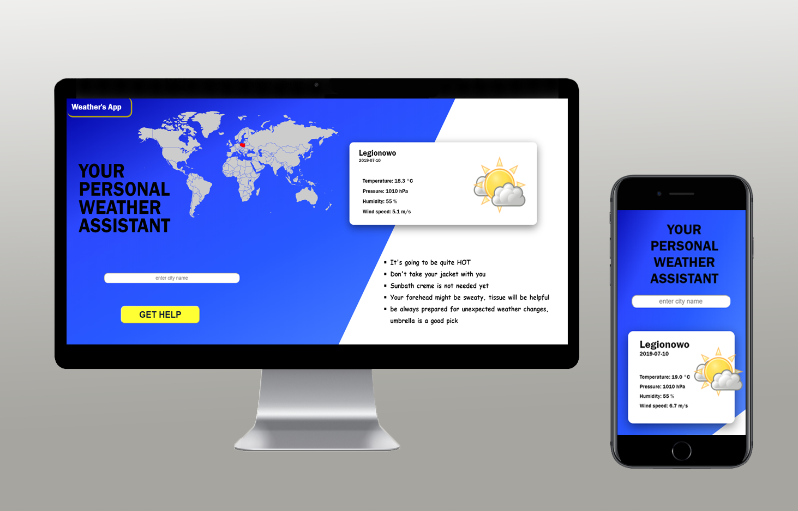

# Weather App based on openweathermap.org

## General info

Weather app based on city input. As additional feature you can see highlighted country connected to inserted city. There is also few tips that depends on temperature value tells what to wear. Feel free to use it whenever you wish to do.

## Screenshots

## Technologies

- HTML 5
- SCSS
- React.js

## Setup / View

There are 3 easy ways to view my project:

- 1. Download ZIP package, create-react-app and build project with npm start
- 2. Use my main portfolio [**GitHub Pages**](https://drozdzyk667.github.io/portfolio_main/).
- 3. Direct link to github pages [**GitHub Pages**](https://drozdzyk667.github.io/React.js-weather-app/).

## Contact

Created by [@drozdzyk92@gmail.com] - feel free to contact me!
